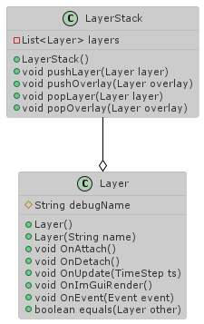

# Layers

A layer system is used for mainly two reasons:

* Draw order.
* Event handling.

## Draw order

The draw order is determined by the order of the layers in layer stack. The first layer pushed to the stack will be the first one to be rendered, allowing other layers to be drawn on top of it.

The main layer will be the 3D window, in which the game will be rendered. The rest of the layers, such as menus, dialogs, etc. will be pushed at the end of the stack. This type of layers (used for 2D menus) are called **overlays**.

## Event handling

Events are, however, handled in **reverse order**. The last layer drawn to the screen will be the the first (and only) layer to handle the event. For example, if there is a button drawn and the user clicks on it, we want the button to process the event, instead of moving the character.

## References

* [Layers | Game Engine series](https://www.youtube.com/watch?v=_Kj6BSfM6P4&list=PLlrATfBNZ98dC-V-N3m0Go4deliWHPFwT&index=13)
